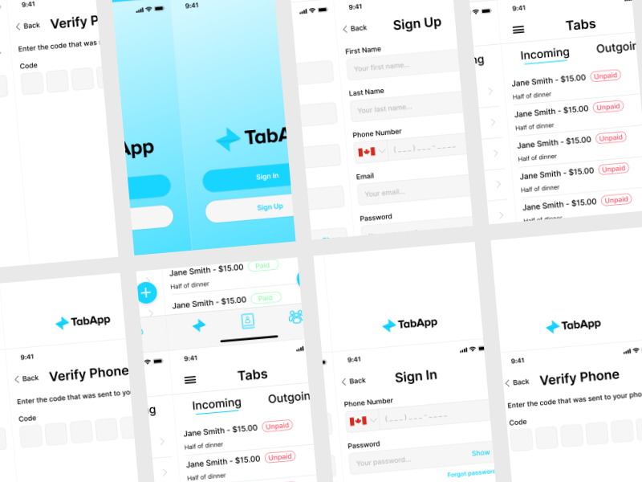

    

---

# TabApp

TabApp is an iOS and Android app for students to track IOUs and expenses with their friends & housemates ✨

🔨 *TabApp is currently in development. It will be available in private beta in September 2021.*

📱 *Check out the [evolving design](https://www.figma.com/file/0IaZJUrvYZuzyKoOnXeejh/Mobile-UI-Kit?node-id=315%3A261)
. You can also see the [original POC design](https://www.figma.com/file/Gym1YV0Cuy7su3tZc5LKhF/TapApp-Beta-Prototype?.node-id=0%3A1)*

## Overview

As students, we're constantly splitting pizzas, lending drinks, and spotting friends food. We split utilities, wifi, and groceries with our housemates. Wouldn't it be great if you didn't have to keep track of all these tabs in your head?

TabApp is a peer-debt management app designed specifically for college students. It is stupid simple and fast to use. While some other apps  support tracking expenses and debts between users, they offer *too many* features, to the extent that entering a debt is so laborious that it is not worth using the app at all. TabApp is designed by students, for students.

## Usage

Adding a debt is as simple as opening the app, clicking the plus sign, selecting a contact, and entering an amount. The person on the other side of the debt does not need to have the app in order for this to work. If they have the app, the debt will be available for them on their "Tabs" page. If they don't have the app, they will receive a link via text or email. Using this link, they can mark the debt as paid when the time comes.

*More coming soon*

## Monorepo

- [apps/mobile](apps/mobile): The mobile app made with [React-Native](https://reactnative.dev/) using [Expo](https://expo.io/)

- [infra](infra): [Pulumi](https://www.pulumi.com/) definitions for infrastructure on [AWS](https://aws.amazon.com/)

- [e2e/mobile](e2e/mobile): Black-box testing for the mobile apps using [Appium](https://appium.io/), [WebdriverIO](https://webdriver.io/), and [Jasmine](https://jasmine.github.io/)

- [backend](backend): Backend services exposed in a GraphQL endpoint using [Apollo Federation](https://www.apollographql.com/docs/federation) *coming soon*

## Contributing

To learn more about how to contribute, see [CONTRIBUTING.md](CONTRIBUTING.md)
